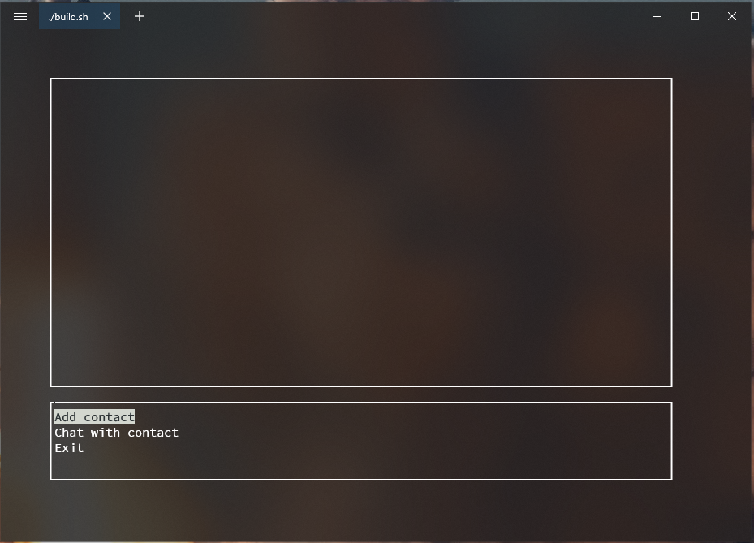

# N2End
(WIP) End to end encrypted terminal chat application for UNIX systems written in C++ with nCurses

## Purpose
This is initally a project to further my understanding in a C++ and to see simple encryption algorithms such as diffie hellman in play. However, the grand idea (epic) is for N2End to be a combination of server and client software. That means that anyone could install the server on any hardware, and have their friends use the client, connected to that specific server. In other words there wont be a single centralized server to store messages and users. Users will rather set the server up themselves.

## From the users eyes
A user can have conversations with other users, but not in group. It will offer a very simple interface.

The interface will consist of two windows. The lower window will be used for selection and for writing messages. The upper part will be used as a banner by default, and it will showcase the conversation when one is active.

## How will it work

From an object oriented stance the application will follow something similar to an MVC pattern, however due to the nature of ncurses, I will not force the view and controller to have strictly sparated responsibilities.

